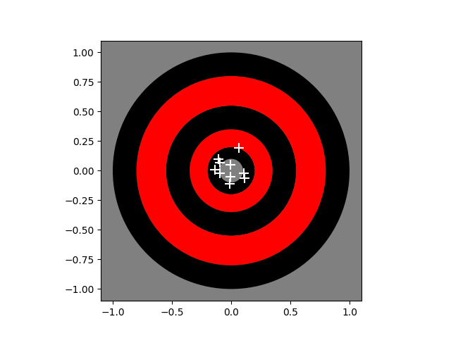

# The Dart Game

<table>
  <tr>
    <td> </td>
    <td>This program simulates throwing darts from a fixed position away from the dartboard. Each throw has random inaccuracies and biases. The goal is to find the optimal throwing angles that compensate for these biases and errors.</td>
  </tr>
</table>

## Task 
By analyzing the landing positions of the thrown darts on the plot, create a program that finds/learns throw angles that lead to more centered and accurate  results.

## Code Structure

 The function ``simulate_3d_dart_throw``  in `dart.py` takes two arguments:  ``angle_x`` and `` angle_y`` The function returns the 2-dimensional position of the dart where it hits the board. 
 
Use the template function ``find_optimal_throw_angles`` to impelment your code.   You can use the function `simulate_3d_dart_throw` to test a few trial angles to get some data to work with.  The goal is to find optimal angles in x and y directions such that the dart lands close to origin `(0,0)`.
  

## Steps to Contribute

This guide provides a brief overview of the steps to share your solution for the dart problem:

1. Clone the repository: `git clone https://github.com/elswit/dart.git `

2. Make changes:
- Navigate to the cloned repository's directory: `cd dart`
- Create a new branch `git checkout -b my-new-branch`
- Modify the necessary files using your preferred editor.

3. Commit your changes:
- Stage the changes: `git add .`
- Commit the changes with a message: `git commit -m "Your commit message"`

4. Push changes and create a pull request:
- Push your branch: `git push origin -u`

- Visit the repository's GitHub page in your browser.
- Click on "Pull Requests" and then "New pull request".
- Select the base branch and your branch with the changes.
- Provide a title and description for your pull request.
- Click on "Create pull request" to submit.

That's it! Your changes are now ready for review and consideration.

